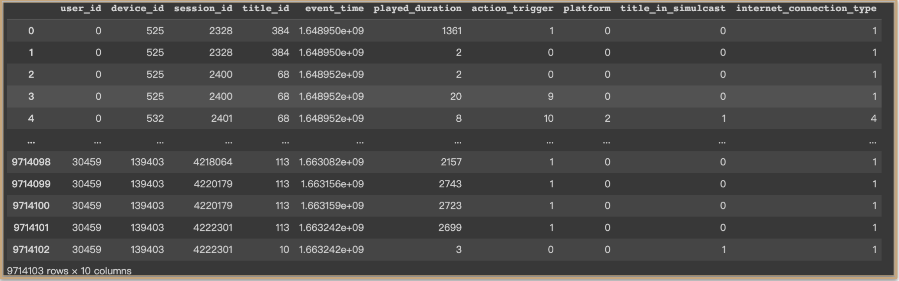

# KKTV_DA

KKTV user watch time prediction using DeepLearning methods.

---

## Data Overview

Including

1. raw data processing (feature selection, time duration conv func)
2. use cross-fold to choose model
3. ensemble the chosen model

- use DL method(LSTM, GRU, Transformer)
- use ML method(XGBoost) & RandomSearchCV to choose params

---

See the pdf <b>KKTV_DA_presentation</b> for more detailed information.

<3
